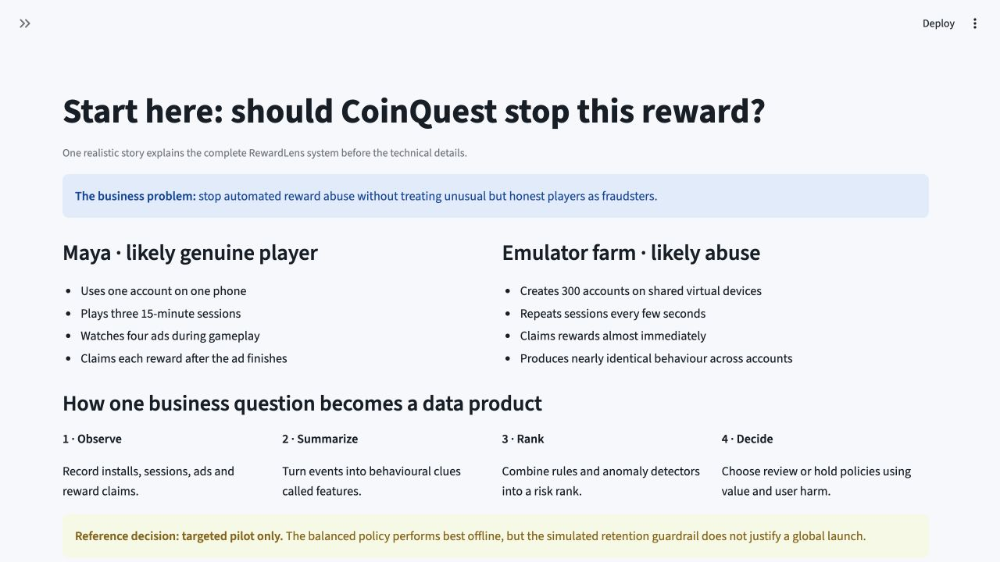
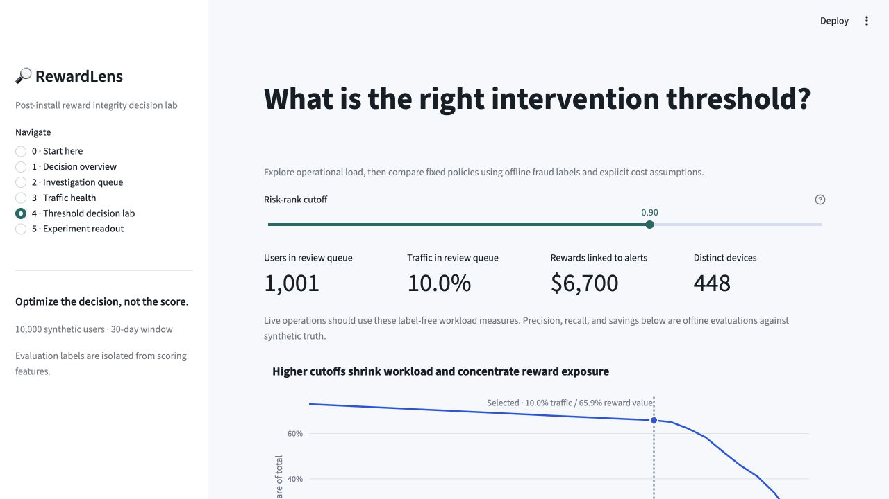
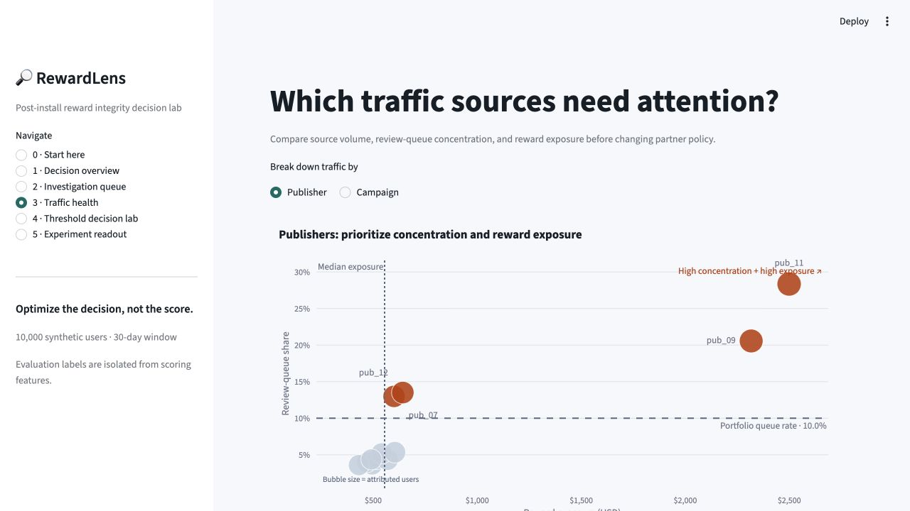
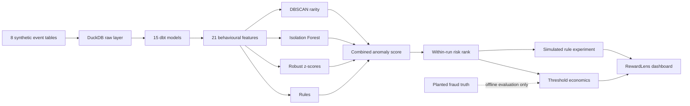

# RewardLens

## Post-Install Fraud Decision Lab

> **Optimize the decision, not the score.**

[](https://rewardlens-fraud-lab.streamlit.app/)
[](https://github.com/chanderbhanu096/rewardlens-fraud-decision-lab/releases/latest)
[](https://www.python.org/)

**[Open the live RewardLens dashboard →](https://rewardlens-fraud-lab.streamlit.app/)**

RewardLens asks one practical question:

> How can a rewarded-app business reduce post-install reward abuse without
> unnecessarily blocking valuable legitimate users?

**Scope:** every user, outcome, label, and financial value in this repository is
synthetic. The results demonstrate analytical reasoning, system design, and
reproducibility—not expected production performance.

## Product tour

The dashboard begins with a real-life comparison between a likely genuine player
and an emulator farm, then progressively reveals the technical evidence.

[](https://rewardlens-fraud-lab.streamlit.app/)

The threshold lab connects review capacity, false positives, fraud recall, and
modeled financial value in one operating decision.

[](https://rewardlens-fraud-lab.streamlit.app/)

The traffic-health view adds a daily, source-specific signal against a baseline
computed from the source's prior seven observed days only. That as-of-time rule
prevents the day being evaluated from leaking into its own benchmark.

[](https://rewardlens-fraud-lab.streamlit.app/)

Each screenshot links directly to the public application.

## Choose your depth

If this is your first behavioural-fraud project, begin with the
[plain-language learning guide](docs/LEARNING_GUIDE.md). It follows one realistic
CoinQuest example from “what is an event?” through anomaly ensembles,
cost-sensitive thresholds, confidence intervals, and production limitations.

If you are reviewing as a senior analyst or data scientist, continue here. The
README states the decision contract, assumptions, evidence, and failure modes;
the learning guide explains the same system without assuming prior knowledge.

## First, build the fence

Senior reviewers may reasonably map this project to something they already know.
Those adjacent ideas are useful boundaries, but they are not RewardLens.

| Often confused with | RewardLens boundary |
|---|---|
| Install-attribution or click fraud | RewardLens starts **after installation** and examines sessions, gameplay, ad views, reward claims, and device relationships. |
| A supervised fraud classifier | It combines interpretable rules with unsupervised detectors. Planted labels are isolated and used only for offline evaluation. |
| A monitoring dashboard | The dashboard exposes the result; the core system is the event contract, SQL feature layer, scoring policy, economics, and experiment decision. |
| A production anti-fraud service | It is a deterministic batch decision lab without live traffic, real labels, SLAs, appeals, or production performance claims. |

## What RewardLens is

RewardLens is a reproducible decision-science environment that turns post-install
events into behavioural risk signals, converts those signals into review or hold
policies, and evaluates each policy against three competing outcomes:

1. fraudulent reward loss prevented;
2. legitimate users inconvenienced;
3. retention risk introduced by intervention.

The central principle is deliberately stricter than “find anomalies”:

> **An anomaly score has no business value until it supports a defensible action.**

## The Winston Star

### 1. Symbol

⚖️ A balance scale with a leaking reward coin on one side and a legitimate user
on the other. The fraud threshold is the movable fulcrum.

### 2. Slogan

> **Optimize the decision, not the score.**

### 3. Surprise

The intuitive assumption is that flagging more users catches more fraud. In the
reference run, the aggressive policy flags **800 additional legitimate users**,
catches **zero additional planted fraud**, and produces about **$732 less**
scenario value than the balanced policy.

### 4. Salient idea

> The best fraud policy is the one that prevents the most loss after legitimate-user
> harm and retention constraints are counted—not the one with the most alerts.

### 5. Story

A rewarded-app team sees payouts rise after a publisher launches a new campaign.
An aggressive detector flags 1,801 accounts and initially appears safer than the
balanced policy. Both policies catch the same 900 planted fraudulent accounts;
the aggressive policy merely adds 800 false positives. A simulated randomized
pilot then reduces fraud cost by 77%, while day-7 retention falls by 1.94 percentage
points and fails the pre-specified non-inferiority guardrail. The defensible next
step is a small, reversible pilot—not an automatic global block.

## Reference decision

The reproducible reference run contains **10,000 users** and **1,136,119 rows**
over a 30-day observation window.

### Threshold policy

| Policy | Users flagged | Precision | Fraud recall | False-positive rate | Scenario net savings |
|---|---:|---:|---:|---:|---:|
| Conservative | 501 | 100.0% | 55.7% | 0.00% | $18,720 |
| **Balanced** | **1,001** | **89.9%** | **100.0%** | **1.11%** | **$26,379** |
| Aggressive | 1,801 | 50.0% | 100.0% | 9.90% | $25,647 |

The balanced policy maximizes modeled value. These are in-sample measurements
against planted synthetic truth, and the score is a **within-run rank—not a
calibrated probability of fraud**.

### Experiment decision

A country-stratified 50/50 simulation applies the balanced rule to treatment
traffic.

| Measure | Result | Decision meaning |
|---|---:|---|
| Fraud reward cost per assigned user | −77.0% | Strong simulated primary-metric improvement |
| Primary-metric p-value | <0.001 | Precise under the simulation assumptions |
| Day-7 retention | −1.94 pp | Potential legitimate-user harm |
| Retention 95% CI | −3.89 to +0.01 pp | Statistically inconclusive; “not significant” does not mean safe |
| Retention non-inferiority margin | −2.00 pp | **Not met:** the lower confidence bound crosses the margin |
| In-sample net value | $2,612 | Positive after blocked legitimate rewards and friction |
| Decision | Targeted pilot only | Do not scale until a confirmatory guardrail test passes |

Country effects are secondary and exploratory. Benjamini–Hochberg correction is
applied before interpreting segments; positive-looking countries are hypotheses,
not rollout evidence.

## From events to a decision



Ground-truth fields live in the separate `mart_evaluation_truth` model. They do
not enter feature generation, anomaly scoring, or risk ranking.

## Decision contract

| Component | Definition |
|---|---|
| Decision unit | One installed user account |
| Observation window | Thirty days of post-install behaviour |
| Context | Country, publisher, campaign, app, and device |
| Signals | Frequency, timing, reward velocity, gameplay depth, device sharing, and peer-relative deviation |
| Offline truth | Planted normal, reward-abuse, emulator-farm, and click-farm populations |
| Objective | Maximize prevented loss after legitimate-user cost |
| Guardrail | Day-7 retention non-inferiority |
| Intended actions | Release, analyst review, step-up verification, or temporary reward hold |

See the [data contract](data_generator/SCHEMA.md) for table grains, keys, and
planted population definitions.

## Detection design

The ensemble combines methods with different failure modes instead of presenting
one opaque model as the answer.

| Method | Role |
|---|---|
| Weighted rules | Encode known and explainable abuse patterns |
| Robust z-scores | Detect heavy-tailed multivariate deviations |
| Isolation Forest | Capture sparse nonlinear anomalies |
| DBSCAN rarity | Identify rare behavioural regions |
| Country-publisher comparison | Distinguish globally unusual behaviour from peer-relative deviation |

The combined score is explicit:

```text
risk = 0.34 × rules
     + 0.24 × robust deviation
     + 0.32 × isolation score
     + 0.10 × cluster rarity
```

The weights are design assumptions, not parameters fitted to the planted labels.
Thresholds operate on cohort-relative percentiles. This makes review capacity
predictable, but it also means a percentile policy cannot independently detect a
population-wide fraud spike; production monitoring needs a frozen reference
distribution, drift checks, or calibrated absolute risk.

## Economic assumptions

Financial outputs are scenario calculations and should be challenged before use.

| Assumption | Current implementation |
|---|---|
| Detection evaluation horizon | Detected fraudulent reward cost multiplied by 4 |
| False-positive cost | `$0.35 + 1.5 × legitimate-user ad revenue` |
| Fraud block effectiveness in experiment | 78% |
| Legitimate reward block fraction | 38% for flagged treatment users |
| User-friction charge | $0.35 per affected legitimate user |
| Default planted fraud prevalence | 9% |

```text
scenario net savings
= projected prevented fraud loss
− false-positive friction cost

experiment net value
= prevented fraud loss
− legitimate rewards blocked
− user-friction cost
```

The $26.4k threshold estimate projects four comparable loss windows across the
full cohort. The $2.6k experiment value is realized only in the 4,999-user
treatment arm. They answer different questions and should not be compared as if
they shared a horizon.

## Reproduce the reference run

Python 3.11 or later is required. All dependencies stay inside a project-local
virtual environment.

```bash
python3.11 -m venv .venv
source .venv/bin/activate
python -m pip install -e '.[dev]'

python -m orchestration.pipeline \
  --users 10000 \
  --days 30 \
  --seed 42

python -m pytest
streamlit run dashboard/app.py
```

Open [http://localhost:8501](http://localhost:8501). To reuse the current event
files while rebuilding analytics and artifacts:

```bash
python -m orchestration.pipeline --skip-generate
```

A successful full run builds 15 dbt models, passes 32 dbt tests, and produces the
anomaly and experiment artifacts. The independent Python suite contains 26 tests,
including chart-semantics and render checks for every dashboard page.

## Inspect the outputs

| Output | Purpose |
|---|---|
| [Model metrics](artifacts/anomaly/model_metrics.json) | Recommended threshold and confusion-matrix measures |
| [Threshold evaluation](artifacts/anomaly/threshold_evaluation.csv) | Policy sensitivity and economics |
| [Policy sensitivity](artifacts/anomaly/policy_sensitivity.csv) | Winning policy across 16 economic-assumption scenarios |
| [Source daily health](artifacts/anomaly/source_daily_health.parquet) | Publisher/campaign reward timing with leakage-safe prior baselines |
| [Experiment summary](artifacts/experiment/experiment_summary.json) | Primary metric, retention guardrail, and economics |
| [Country effects](artifacts/experiment/country_effects.csv) | Segment estimates and adjusted p-values |
| [Decision memo](artifacts/experiment/recommendation.md) | Executable rollout recommendation |
| [Pipeline manifest](artifacts/pipeline_manifest.json) | Row counts and run metadata |

## Repository map

| Path | Responsibility |
|---|---|
| `data_generator/` | Deterministic relational event simulation |
| `sql/` | Raw DuckDB ingestion |
| `dbt_project/` | Staging, features, peer baselines, marts, and tests |
| `anomaly_detection/` | Multi-method scoring and threshold economics |
| `experiment_analysis/` | Simulated outcomes, inference, and segment analysis |
| `orchestration/` | End-to-end Prefect flow |
| `dashboard/` | Decision-oriented Streamlit interface and tested chart builders |
| `tests/` | Generator, scoring, experiment, dashboard, and chart validation |
| `architecture/` | System-design documentation |
| `assets/screenshots/` | Verified dashboard images used in this README |

## Versioning

RewardLens follows semantic versioning. The GitHub `main` branch is the latest
stable portfolio version, while immutable `vX.Y.Z` tags identify published
releases. See the [changelog](CHANGELOG.md) for release-level changes.

## Limitations and production path

1. **Synthetic validity:** planted truth is perfectly known offline; real fraud
   labels are delayed, incomplete, adversarial, and selection-biased.
2. **Generalization:** current metrics are in-sample. Production work requires
   temporal backtesting, out-of-time validation, calibration, and drift analysis.
3. **Economics:** loss and friction coefficients are assumptions rather than
   estimates from finance, support, operations, or causal measurement.
4. **Peer baselines:** production cohorts need minimum sample sizes, shrinkage,
   and strict as-of-time computation.
5. **Operating system:** deployment requires streaming features, entity
   resolution, human-review feedback, appeals, privacy controls, and rollback
   criteria.

## Contributions

RewardLens contributes:

- a reproducible relational benchmark for post-install behavioural fraud;
- a leakage-aware SQL feature layer with contextual peer comparisons;
- an interpretable multi-method anomaly ensemble;
- a transparent connection between detection thresholds and business costs;
- an experiment analysis that treats retention and heterogeneous effects as
  decision constraints rather than footnotes.

> **Fraud detection is not the act of finding every anomaly. It is the discipline
> of deciding whom to inconvenience, why, and at what expected cost.**
