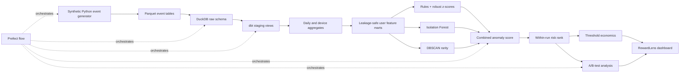

# RewardLens architecture

```mermaid
flowchart LR
    A["Synthetic Python event generator"] --> B["Parquet event tables"]
    B --> C["DuckDB raw schema"]
    C --> D["dbt staging views"]
    D --> E["Daily and device aggregates"]
    E --> F["Leakage-safe user feature marts"]
    F --> G["Rules + robust z-scores"]
    F --> H["Isolation Forest"]
    F --> I["DBSCAN rarity"]
    G --> J["Combined anomaly score"]
    H --> J
    I --> J
    J --> R["Within-run risk rank"]
    R --> K["Threshold economics"]
    R --> L["A/B-test analysis"]
    K --> M["RewardLens dashboard"]
    L --> M
    N["Prefect flow"] -. orchestrates .-> A
    N -. orchestrates .-> C
    N -. orchestrates .-> D
    N -. orchestrates .-> J
    N -. orchestrates .-> L
```

Ground-truth fraud labels are isolated in `mart_evaluation_truth`. They are
joined only after scoring for offline evaluation and never enter model features.
